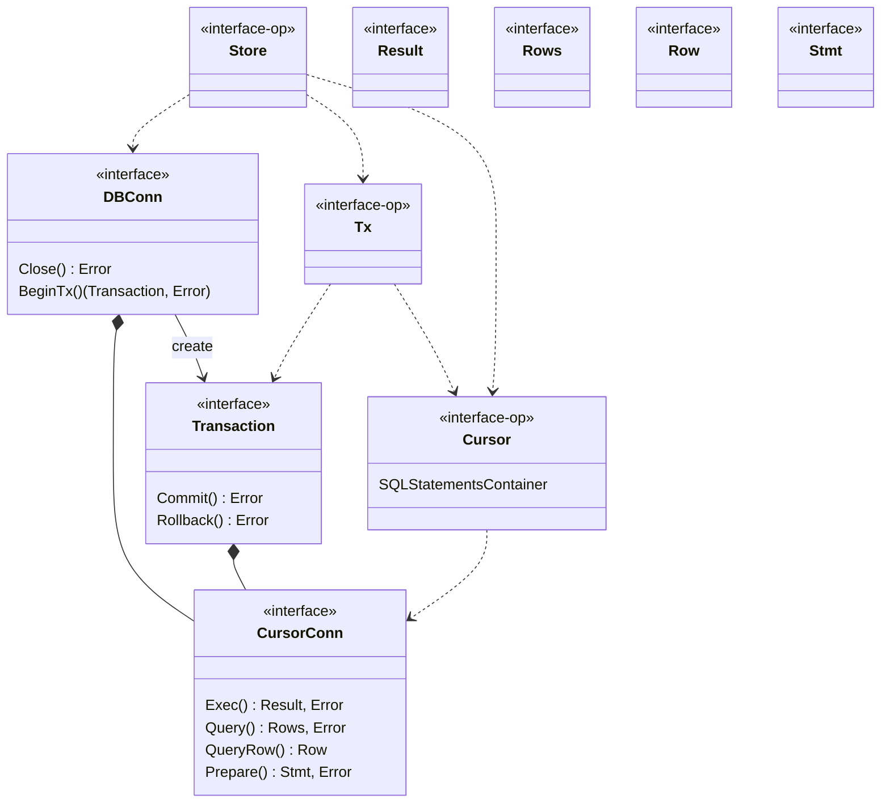
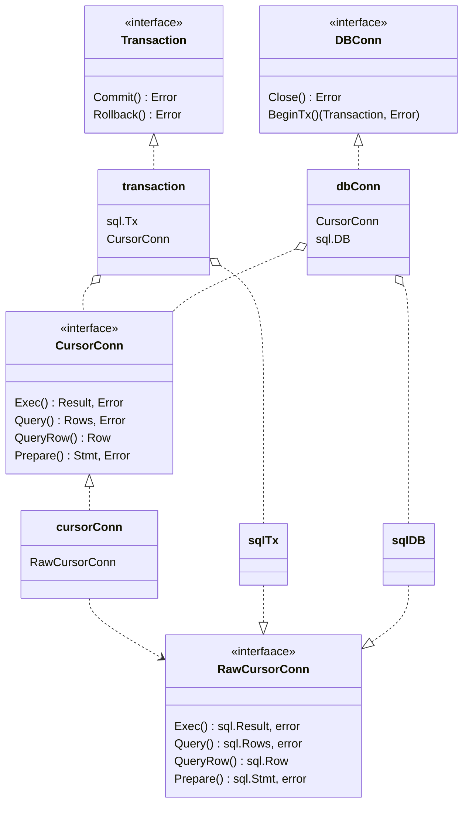

# 类图设计



# mysqlDriver实现




## job erDiagram
```mermaid
erDiagram

system ||-- o{ workAPP: compose
workAPP ||--|{ workComponent: owner
system || --o{ workComponent: compose

system ||--o{ JobRecord: "install/update job"
JobRecord ||--|| curAPP: cur
JobRecord ||--|| targetAPP: target

curAPP ||--|| APPins: is
targetAPP ||--|| APPins: is

APPins ||--|{ component: compose

workAPP ||--|| APPins: is
workComponent ||--|| component: is

edge ||--|| fromComponent : from
edge ||--|| toComponent: to
system ||--|{ edge: compose

fromComponent ||--|| component: is
toComponent ||--|| component: is

```