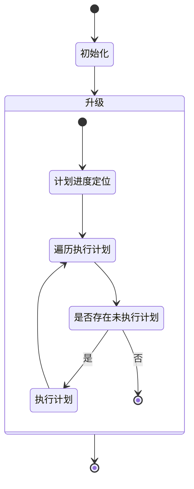
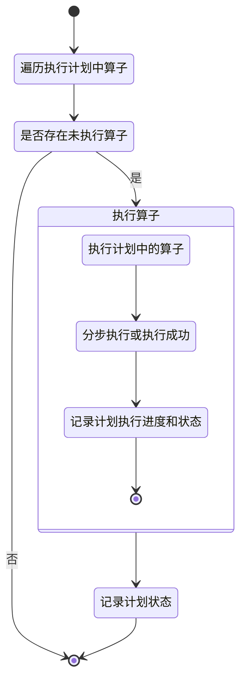
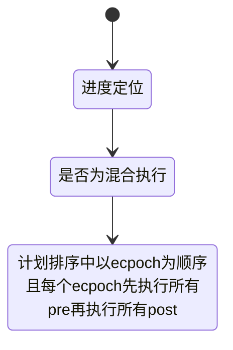

[toc]


# 一、背景

服务版本升级、回退时可能会涉及到关系数据库表结构和数据内容的升级。而且很多项目是以容器化的方式运行在k8s上的，安装和更新又是基于如helm chart的方式执行和管理。因此需要两方面内容：

1. 服务的关系数据库的安装/升级流程以及其快速上手的脚手架与制品生成。
2. 制品生成后的到helm chart模式的融入相应的脚手架。


# 二、关系数据库升级流程

一个服务的数据升级根据其服务内容和设计的复杂度，视情况存在"服务更新前"和"服务更新后"两个阶段，分别运行在服务版本更新前后，下文简称"pre"和"post"阶段

1. 在简易的服务设计和数据库内容中，可能仅仅需要"服务更新前"阶段即可完成。如在满足数据向后兼容的前提下，为表增加字段。
2. 复杂服务设计或数据升级中，会需要两个阶段的协同工作。
   1. 例如字段内容升级。
      1. 可能需要"服务更新前"阶段创建过渡状态，如将原表改名为临时表名，以视图(或其他技术)为原表名以支持当前版本服务的查询和旧服务新数据插入。在此期间对已有数据内容进行更新。
      2. "服务更新后"阶段关闭过渡状态并完成最后的升级，以本例可能的行为为将视图去除，并将临时表更名为原表等。
3. 复杂的设计中甚至可能出现在两个阶段中还需要调用服务的新旧版本接口获取一些数据或进行一些控制行为。
   1. 基于下文提及的问题和复杂性设计，这种行为不要出现，将数据升级变成一种确切的行为，而不是有服务状态控制。基于服务的控制行为变为可配置的操作。
4. 复杂设计中如果服务是跨版本升级，可能需要两个阶段交替运行，但此时服务的版本状态是无非满足的，因此需要相应的数据库执行的设计，在真正执行上避免这种交替运行，而是按一定的策略组合执行，将两个阶段合并，在交替的或直接升级到最新版本。当然此时可能需要对服务进行停止。


# 三、数据升级执行器设计

## 概要

如果使用golang为执行器编程语言，由于golang没有jit能力(.so文件的方式不是个好办法)，因此执行内容和执行计划不用使用golang语言描述。需要额外的表示方式表示执行内容和计划，再有执行器进行解释执行。

考虑日常开发实际是和日期相关的，因此考虑使用秒级日期作为执行动作的唯一标识，并基于日期顺序作为执行计划的一个重要进度控制。

整体上划分出以下概念：

* 执行动作算子：执行器执行的最基本单位，有执行器提供最基本的操作算子，有基于算子定义操作。执行器代为执行。下文简称算子。算子类型和写法见下文。
* 执行计划：某次升级的执行计划，计划为算子定义的集合，代表的是两个阶段的各个执行，两两相互对应。执行计划表示见下文。
* 总体执行计划：根据当前系统状态，结合所有执行计划计算出来的真正需要运行的执行动作算子和流程。

## 开发侧执行计划表示

```shell
<dbtype>
|---- pre
      |---- <date_id>_<epoch>_<short_comment>.yaml
      |---- <date_id>_<epoch>_<short_comment>.yaml
|---- post
      |---- <date_id>_<epoch>_<short_comment>.yaml
      |---- <date_id>_<epoch>_<short_comment>.yaml
init.sql
```

* dbtype：以一个目录\<dbtype>表示某种类型的关系数据库下的所有执行计划，每个执行计划以yaml格式描述其中的执行算子。
* date_id：以秒级日期为计划唯一id，因为字符长度会保持一致，即使文件查看也可以因为字符序看到基本顺序。pre目录和post目录相对应的脚本应该保持data_id一致。
* epoch：计划世纪，每个版本一个世纪，用于两个阶段混合执行
* short_comment：该脚本的简短用途。
* init.sql：如果服务为安装，不会执行pre和post，仅需要对数据库完成初始化，即此处的init.sql

## 总体执行计划表示

针对上文开发侧执行计划表示输入，最终构建出的大致计划为

```shell
<dbtype>
|---- pre
      |---- <order>_<date_id>_<epoch>_<short_comment>.yaml
      |---- <order>_<date_id>_<epoch>_<short_comment>.yaml
|---- post
      |---- <order>_<date_id>_<epoch>_<short_comment>.yaml
      |---- <order>_<date_id>_<epoch>_<short_comment>.yaml
init.sql
```

* order：为基于date_id排序的从0开始单调递增的序号

数据库执行计划进度对象为`<order, date_id, state, options>`三元组。增加引入order的目的在于开发时可能因为多分支开发从而导致存在中间插入，仅使用data_id无法准确描述进度，导致丢失执行。在order与date_id不一致时通过查找进度存储和当前计划的共同前驱节点获得真正的计划进度，从前期节点开始，但忽略已执行节点。

但是当两个计划间相互产生影响且无法产生正确效果时仍需要由人进行合并或调整，这类似一个代码两人提交后产生的冲突需要解决一般。但在此处可能会因为分为两个计划文件而无法识别。鉴于这个因素考虑，也许应该将总体执行计划作为分支开发代码产物之一，利用git能力发现代码冲突。

执行进度查询伪代码如下：

```go
type plan struct {
    order_id int
    date_id int
    option any
}

func GetProcessPlan() {
    var plans []plan
    var cur plan

    curlPlan := plans[cur.order_id]
    if curPlan.date_id < cur.date_id {
        parentOrder :=    findParentOrder(store, plans, cur.date_id)
        curPlan = plans[parentOrder+1]
    }else if cur.Plan.date_id > cur.date_id {
        panic("不应该出现，存在恶意破坏或调整，应手工处理异常数据")
    }  
    return curPlan
}

func findParentOrder(store, plans, index, id) {
    // plans = 1 2 3 4 5
    // store = 1    3    5
    // return 1 --> index is 0
    for  {
        last := store.lastLess(plans[index].date_id)
        lastShadow := plans[last.order]
        if last.date_id > lastShadow.date_id {
            index = last.order
            id = lastShadow,date_id
        }else {
            return last.order
        }
    }
}
```

## 总体计划的执行

### 两阶段执行模式流程

1. 升级框架仅执行pre目录下计划
2. 服务更新升级
3. 升级框架仅执行post目录下计划

### 混合执行模式流程

升级框架混合交替执行pre和post目录下相同epoch的计划。相同epoch先执行pre后执行post。顺序如下

```shell
pre-<order>_<date_id>_1_<short_comment>.yaml
pre-<order>_<date_id>_1_<short_comment>.yaml
post-<order>_<date_id>_1_<short_comment>.yaml
pre-<order>_<date_id>_2_<short_comment>.yaml
```

## 执行计划文件内容表示

以yaml格式为例，实际按需要可以扩充类似格式的表示方式。只是yaml写法相对简单。

```
<name>:
	command: <command>
	<args>: <args>
```


# 四、执行算子

## sql升级需求分析

常见sql升级有以下行为：

1. 数据表、索引结构升级等ddl语句
2. 数据库数据升级或迁移等dml语句

行为需求：

1. 一般的ddl语句如果具备online ddl并且其支持instant与no copy，对ddl的执行不需要额外的输入参数，也不会需要输出返回作为后续执行的输入参数。
2. 对一些简易的数据升级，耗时较少，过程轻量，仅需要保证一定程度的幂等性。
3. 对一些复杂的数据升级，耗时教高，过程教重，一次执行需要将过程拆分为多次执行，以降低升级过程的数据影响范围，以及重型任务的反复处理。可能需要额外的进度控制和进度控制参数。
4. 对一些复杂的数据升级，其复杂性在于数据升级的复杂逻辑，不是一句或几句简单的sql语句完成的，而是需要基于sql语句的执行结果决定下文的执行。因此可能需要如闭包函数、迭代器等高级函数能力。
5. 混合了3和4点的复杂性问题

## 高阶函数算子场景收集

应是多种高阶函数算子以应对各种场景，具体有哪些和如何表示还没想好。目前自己还用不上这些，先做场景、方案和实现逻辑收集，后续再针对性进行抽象和规划统一实现。在诸如python之类的实现中由于其jit能力，实现可能更简单些。即是有jit能力则用对应语言写代码，无jit能力就是使用算子(等于某语言)些写代码。

### 分步更新数据内容

常见场景如对数据库基于字段A计算出新字段B的值，如`update tableT  set B=A + 1;`在以下条件中会存在缺陷

1. 如果服务不停机，那么仅在pre阶段执行后，对服务产生的新数据仍需要post阶段再次执行。
2. 如果tableT是个大表，那么将会导致
   1. 两次执行存在很多时间浪费
   2. 如果过程中升级程序崩溃后，进度未做记录，重复执行仍会浪费大量进度。

因此该算法可以基于数据特性（如使用自增ID）优化为如下不严谨的伪代码

```

rowAffect = 1
for rowAffect!=0 {
	lastProgress
	offset = 0 or lastProgress
	lastID = `select from id tableT limit 1 offset {offset}`
   rowAffect=`update tableT set B=A+1 where id > lastID`
   offset += rowAffect
   store {offset} into plan store as lastProgress
}
store finish  into plan store  as lastProcess

```

从以上伪代码可以发现对执行算子有如下要求：

1. 算子能设定如代码中的rowAffect的变量和条件设定，并在执行时基于当前真实值进行计算是否完成。
2. 能将某个值如伪代码中的offset作为执行过程数据返回，并保存，在算子重复执行时传入。
3. 算子部分代码的表示，如伪代码中的`offset =`到`offset +=`行。这些几行在使用算子时甚至可能需要通过如"闭包"和"高级函数"算子的方式提供每一行的表示与串联执行。


## 重要的限制与要求

1. 即使整套算子执行机制中含有一定的进度记录与控制，可以避免一定程度的重复执行，但更多的是为了减少无必要的重复执行带来的开销，并不能保证某个算子以及算子的过程不会被重复执行。**算子内容需要保证其幂等性**

### 直接执行无输出sql算子

该算子行为诸如执行sql脚本，脚本内操作相对轻量。如[mariadb online ddl](https://mariadb.com/kb/en/innodb-online-ddl-overview/#alter-algorithms)中instannt级别的算法，或支持none级别的锁需求。因为它们的执行所需时间较低且无锁行为不会损耗业务的正常行为。甚至对于一些nocopy算法且none锁的ddl也是可以适用的。

| 字段名           | 类型     | 说明                                                         | 必填 |
| ---------------- | -------- | ------------------------------------------------------------ | ---- |
| command          | string   | 算子类型，值固定为execute                                    | 是   |
| Args.statements  | []string | 执行的语句数组，某些数据库或规范限制不允许使用"多语句执行"，使用数组表示可以让程序对语句进行分步执行，以及进度控制 | 是   |
| Args.transaction | bool     | 是否对多语句执行，开启事务行为。注意有些语句不在事务控制范围内，该类多语句建议切割为多个算子表示。默认为否 | 否   |

### 高阶函数算子XXXX

TODO


# 五、整体逻辑设计

## 数据对象

```go
// Operator 算子表示
type Operator  struct {
    // 算子类型
	 Command string
    // 各个算子实现提供的参数配置.
     Args json.Rawstring
}

type ExecuteOP struct {
    //    执行语句
    Statements []string
    //   开启事务
    transaction bool
}

// PlanMeta  执行计划元数据
type PlanMeta struct {
        // 从文件名中自动提取的执行计划文件日期，必须精确到秒
    DateID int
    // 从文件名中自动提取的执行计划代数，一般跟随版本单调递增
    Epoch int
    // 服务名称，可用于隔离不同服务的执行
    ServiceName string
    // 执行阶段，即pre或post
    Stage int
}
// Plan 执行计划文件表示
type Plan struct {
	PlanMeta
    // 执行计划文件内的表示
    Operators []Operator
}

// 	PlanProcess 执行计划记录, 持久化在生产环境存储中
type PlanProcess struct {
    PlanMeta
    // 在计划中的排序
    Order int
    // 执行计划状态
    Status int
   // 当前执行的算子记录
   Op  OperatorProcess
}

// OperatorProcess 执行计划中某个算子的执行记录
type OperatorProcess struct {
    // 算子在执行计划中的排序，因执行计划文件不可更改，因此可直接使用排序作为唯一id
    OrderID int
    // 执行状态
    Status int
    // 过程中间数据，由对应算子定义、序列化、反序列化和各种使用。如用于内部进度控制等
    TempData json.Rawstring
}

// Plans 对执行计划目录遍历获得的总体执行计划，与执行程序绑定。基于环境执行计划会重新排序与执行。
type Plans []Plan


```

## 执行状态机

### 整体状态图



如果对"初始化"和"升级"存在需要基于安装或升级进行区分,而不是必执行"初始化",那么对应流程有两个问题:

1. 服务可能已经部署,而此时该升级框架第一次使用,此时无法知道应执行"初始化"或是"升级"。

2. 如果清理数据时,仅清理服务的数据库,而不清理升级框架的数据库存储,将会导致其不会"初始化"

   而在上图流程中可以解决这个问题。但是会新增额外的要求："初始化"在已有环境中，可以不生效(0.0.1版

的字段类型为chart, 新版本为varchart,此时虽然init不生效, 但是后续的执行计划中的算子会将chart升级为varchart)，但是必须幂等,"初始化"文件里的算子是可以修改的.

### 执行单个计划




### 整体计划生成



